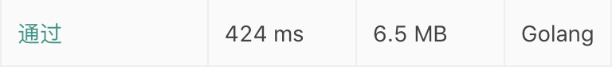

## 题目

[无重复字符的最长子串](https://leetcode-cn.com/problems/longest-substring-without-repeating-characters)

难度：**中等**

给定一个字符串，请你找出其中不含有重复字符的 **最长子串** 的长度。

## 示例输出

1. ```
    输入: "abcabcbb"
    输出: 3
    解释: 因为无重复字符的最长子串是 "abc"，所以其长度为 3。
   ```
2. ```
   输入: "bbbbb"
   输出: 1
   解释: 因为无重复字符的最长子串是 "b"，所以其长度为 1。
   ```
3. ```
   输入: "pwwkew"
   输出: 3
   解释: 因为无重复字符的最长子串是 "wke"，所以其长度为 3。
   请注意，你的答案必须是 子串 的长度，"pwke" 是一个子序列，不是子串。
   ```

## 解析

逐个检查所有的子字符串，看它是否不含有重复的字符。

### 暴力法

简单粗暴的循环，一个双层循环判断最大值，但是执行效率极低， 复杂度 O(n^3)
伪代码如下：

```
从字符串的第 i 位开始循环， i 的初始值为 0 ，最大值为 字符串的长度
  从字符串的第 j 位开始循环， j 的初始值为 i ，最大值为 字符串的长度
    如果第 j 位已经出现过，则break j 的循环
  检测当前长度是否是最长，如果是则更新最长长度
```

golang 如下：

```golang
func lengthOfLongestSubstring(s string) int {
	maxLength := 0
	for i := 0; i < len(s); i++ {
		hash := make(map[byte]interface{})
		for j := i; j < len(s); j++ {
			if _, ok := hash[s[j]]; ok {
				break
			}
			hash[s[j]] = struct{}{}
		}
		if maxLength < len(hash) {
			maxLength = len(hash)
		}
	}
	if len(s) > 0 && maxLength == 0 {
		maxLength = 1
	}
	return maxLength
}
```

执行结果:


### 滑动窗口

以上实验可以看出暴力法的效率极低，我们对暴力法做一些改造，设立两个游标，游标间为不重复的字符，计算游标间的最大长度
伪代码如下：

```
设置游标i，j
如果游标j位 和 i到j之前任一位相同，记录j - i 之间的长度
移动 i 到 i和j之间相同哪位的后一位
```

```golang
func lengthOfLongestSubstring(s string) int {
	maxLength := 0
	hash := make(map[byte]int)
	i := 0
	for j := 0; j < len(s); j++ {
		if index, ok := hash[s[j]]; ok && index >= i {
			i = index + 1
		}else{
            newLength := j - i + 1
            if maxLength < newLength {
				maxLength = newLength
			}
        }
		hash[s[j]] = j
	}
	if len(s) > 0 && maxLength == 0 {
		maxLength = 1
	}
	return maxLength
}
```

执行结果:
可以看出比暴力法快了许多

