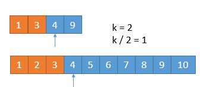

## 题目

[寻找两个有序数组的中位数](https://leetcode-cn.com/problems/median-of-two-sorted-arrays)

难度：**困难**

给定两个大小为 **m** 和 **n** 的有序数组  **nums1** 和  **nums2**。

请你找出这两个有序数组的中位数，并且要求算法的时间复杂度为  O(log(m + n))。

你可以假设  **nums1**  和  **nums2**  不会同时为空。

## 示例输出

1. ```
    nums1 = [1, 3]
    nums2 = [2]

    则中位数是 2.0
   ```

2. ```
   nums1 = [1, 2]
   nums2 = [3, 4]

   则中位数是 (2 + 3)/2 = 2.5
   ```

## 解析

中位数，是按顺序排列的一组数据中居于中间位置的数，其可将数值集合划分为相等的上下两部分。

### 合并法

合并两个有序数组, 根据元素个数的奇偶，取出中位数

但是这个复杂度为 O(m+n)

伪代码如下：

```
合并nums1 和 nums2 到有序数组 nums3
计算nums3的长度 除以 2 的余数是否为零
   如果为零，则 中位数 为 第（nums3 除以 2 ）位 + 第（nums3 除以 2 - 1）位 /2
   否则中位数 为 第（nums3 除以 2 ）位
```

golang 如下：

```golang
func findMedianSortedArrays(nums1 []int, nums2 []int) float64 {
	nums1Len := len(nums1)
	nums2Len := len(nums2)
	nums3 := make([]int, 0)

	if nums1Len == 0 {
		if (nums2Len % 2) == 0 {
			return float64(nums2[nums2Len/2-1]+nums2[nums2Len/2]) / 2
		}
		return float64(nums2[nums2Len/2])
	}

	if nums2Len == 0 {
		if (nums1Len % 2) == 0 {
			return float64(nums1[nums1Len/2-1]+nums1[nums1Len/2]) / 2
		}
		return float64(nums1[nums1Len/2])
	}

	var count, index1, index2 = 0, 0, 0
	for count != (nums1Len + nums2Len) {
		if index1 == nums1Len {
			for index2 != nums2Len {
				nums3 = append(nums3, nums2[index2])
				index2++
				count++
			}
			break
		}
		if index2 == nums2Len {
			for index1 != nums1Len {
				nums3 = append(nums3, nums1[index1])
				index1++
				count++
			}
			break
		}

		if nums1[index1] < nums2[index2] {
			nums3 = append(nums3, nums1[index1])
			index1++
		} else {
			nums3 = append(nums3, nums2[index2])
			index2++
		}
		count++
	}

	if (count % 2) == 0 {
		return float64(nums3[count/2-1]+nums3[count/2]) / 2
	}
	return float64(nums3[count/2])
}

```

执行结果:


### 伪合并

有了前一种方法，我们发现其实不用真的完全合并两个数组，只需要找到中位数是第几位就可以，所以叫他伪合并。

伪代码如下：

```
设置游标i，j
如果游标j位 和 i到j之前任一位相同，记录j - i 之间的长度
移动 i 到 i和j之间相同哪位的后一位
```

```golang
func findMedianSortedArrays(nums1, nums2 []int) float64 {
	nums1Len := len(nums1)
	nums2Len := len(nums2)
	countLen := nums1Len + nums2Len
	left, right, nums1Index, nums2Index := 0, 0, 0, 0
	for i := 0; i <= countLen/2; i++ {
		left = right
		if nums1Index < nums1Len && (nums2Index >= nums2Len || nums1[nums1Index] < nums2[nums2Index]) {
			right = nums1[nums1Index]
			nums1Index++
		} else {
			right = nums2[nums2Index]
			nums2Index++
		}
	}
	if (countLen % 2) == 0 {
		return float64(left+right) / 2
	}
	return float64(right)
}
```

执行结果:


### 二分法

以上两种解法虽然解决了问题，但是没有达到 O(log(m+n)) 的复杂度。

中位数，就是一个数组最中间的一个数，可以将数组分位上下相等的两部分，那我们就可以对数组进行切分。

一个为 **m** 的数组，我们有 m+1 种切法

我们把数组 A 和数组 B 分别在 i 和 j 进行切割。


将 **i** 和 **j** 的左半部分，合并为新的左半部分

将**i** 和 **j** 的右半部分，合并为新的右半部分

- 当 a + b 的长度为偶数个时

  1.  左半部分等于右半部分

      ```
      即：i + j = m - i + n - j , 也就是 j = ( m + n ) / 2 - i
      ```

  2.  左半部分最大的值小于等于右半部分最小的值 max ( A [ i - 1 ] , B [ j - 1 ]）） <= min ( A [ i ] , B [ j ]））

      ```
      那么，中位数就可以表示如下
      (左半部分最大值 + 右半部分最小值 ）/ 2。
      max ( A [ i - 1 ] , B [ j - 1 ]）+ min ( A [ i ] , B [ j ]）） / 2
      ```

- 当 A 数组和 B 数组的总长度是奇数时，如果我们能够保证

  1.  左半部分的长度比右半部分大 1

      ```
      i + j = m - i  + n - j  + 1
      即：j = ( m + n + 1) / 2 - i
      ```

  2.  左半部分最大的值小于等于右半部分最小的值 max ( A [ i - 1 ] , B [ j - 1 ]）） <= min ( A [ i ] , B [ j ]））

      ```
      	  那么，中位数就是
      	  左半部分最大值，也就是左半部比右半部分多出的那一个数。
      	  max ( A [ i - 1 ] , B [  j - 1 ]）
      ```

上面两个条件可以合并一下成 **j=(m+n+1)/2−i**,因为当 m+n 为偶数时，加 1 不会影响除以二的结果。

当然，由于 0 <= i <= m ，为了保证 0 <= j <=n

```
即 j = ( m + n - 2i) / 2
     0 <=  m + n - 2i
```

所以我们必须保证 m <= n。

```
m ≤ n
i < m
j = ( m + n + 1 ) / 2 − i ≥ ( m + m + 1 ) / 2 − i > ( m + m + 1 ) / 2 − m = 0

m <= n
i > 0
j = ( m + n + 1 ) / 2 - i <= ( n + n + 1 ) / 2 - i < ( n + n + 1 ) / 2 = n

```

最后取整除 1/2 = 0

因为 A，B 是有序数组，为了保证 max ( A [ i - 1 ] , B [ j - 1 ]）) <= min ( A [ i ] , B [ j ]））)，所以 A[ i -1 ]<= A[ i ], B[ j - 1 ]<= B[ j ] 是必然满足的，但是 A[ i ] 和 B[ j - 1 ]的情况又不唯一，所以分情况讨论

- B[ j - 1 ] > A[ i ], 并且保证 j != 0 , i != m, 防止越界
  
  此时需要增加 i 并且减小 j， 来保持数量平衡

- A [ i - 1 ] >B [ j ], 并且保证 i != 0, j != n, 防止越界
  
  此时和上边的情况相反，我们要减少 i ，增大 j 。

- 另外两种临界情况
  - 左边界，当 i = 0 或者 j = 0
    
    此时左半部分当 j = 0 时，最大的值就是 A [ i - 1 ] ；当 i = 0 时 最大的值就是 B [ j - 1] 。 右半部分 最小值 为 min ( A [ i ] , B [ j ]））)
  - 右临界， 当 i = m 或者 j = n
    
    此时左半部分最大值还是 max ( A [ i - 1 ] , B [ j - 1 ]）), 当 i = m 是，右半部分最大值就是 B[ j ], j = n 时同理

整理思路依赖变量 i , 那 i 的取值我们就是用二分法，初始值为中间值，然后减半取中值，知道找到结果。
以上就是整体思路。

golang 实现如下：

```golang
func findMedianSortedArrays(nums1, nums2 []int) float64 {
	nums1Len := len(nums1)
	nums2Len := len(nums2)
	if nums1Len > nums2Len {
		return findMedianSortedArrays03(nums2, nums1)
	}
	iMin := 0
	iMax := nums1Len
	halfLen := (nums1Len + nums2Len + 1) / 2
	for iMin <= iMax {
		i := (iMin + iMax) / 2
		j := halfLen - i
		if i < iMax && nums2[j-1] > nums1[i] {
			iMin = i + 1
		} else if i > iMin && nums1[i-1] > nums2[j] {
			iMax = i - 1
		} else {
			maxLeft := 0.0
			if i == 0 {
				maxLeft = float64(nums2[j-1])
			} else if j == 0 {
				maxLeft = float64(nums1[i-1])
			} else {
				maxLeft = math.Max(float64(nums1[i-1]), float64(nums2[j-1]))
			}
			if (nums1Len+nums2Len)%2 == 1 {
				return maxLeft
			}
			minRight := 0.0
			if i == nums1Len {
				minRight = float64(nums2[j])
			} else if j == nums2Len {
				minRight = float64(nums1[i])
			} else {
				minRight = math.Min(float64(nums1[i]), float64(nums2[j]))
			}
			return (maxLeft + minRight) / 2
		}
	}
	return 0
}
```

执行结果：


### 第 k 小的数

该思路来自@**windliang**老哥

题目是求中位数，其实就是求第 k 小数的一种特殊情况，而求第 k 小数有一种算法。

由于数列是有序的，其实我们完全可以一半儿一半儿的排除。假设我们要找第 k 小数，我们可以每次循环排除掉 k/2 个数。看下边一个例子。

假设要找第 7 小的数字


我们比较两个数组的第 k/2 个数字，如果 k 是奇数，向下取整。也就是比较第 33 个数字，上边数组中的 44 和下边数组中的 33，如果哪个小，就表明该数组的前 k/2 个数字都不是第 k 小数字，所以可以排除。也就是 11，22，33 这三个数字不可能是第 77 小的数字，我们可以把它排除掉。将 13491349 和 4567891045678910 两个数组作为新的数组进行比较。

更一般的情况 A[1] ，A[2] ，A[3]，A[k/2] ... ，B[1]，B[2]，B[3]，B[k/2] ... ，如果 A[k/2] < B[k/2] ，那么 A[1]，A[2]，A[3]，A[k/2]都不可能是第 k 小的数字。

A 数组中比 A[k/2] 小的数有 k/2-1 个，B 数组中，B[k/2] 比 A[k/2] 小，假设 B[k/2] 前边的数字都比 A[k/2] 小，也只有 k/2-1 个，所以比 A[k/2] 小的数字最多有 k/1-1+k/2-1=k-2 个，所以 A[k/2] 最多是第 k-1 小的数。而比 A[k/2] 小的数更不可能是第 k 小的数了，所以可以把它们排除。

橙色的部分表示已经去掉的数字。


由于我们已经排除掉了 3 个数字，就是这 3 个数字一定在最前边，所以在两个新数组中，我们只需要找第 7 - 3 = 4 小的数字就可以了，也就是 k = 4。此时两个数组，比较第 2 个数字，3 < 5，所以我们可以把小的那个数组中的 1 ，3 排除掉了。



我们又排除掉 2 个数字，所以现在找第 4 - 2 = 2 小的数字就可以了。此时比较两个数组中的第 k / 2 = 1 个数，4 == 4，怎么办呢？由于两个数相等，所以我们无论去掉哪个数组中的都行，因为去掉 1 个总会保留 1 个的，所以没有影响。为了统一，我们就假设 4 > 4 吧，所以此时将下边的 4 去掉。


由于又去掉 1 个数字，此时我们要找第 1 小的数字，所以只需判断两个数组中第一个数字哪个小就可以了，也就是 4。

所以第 7 小的数字是 4。

我们每次都是取 k/2 的数进行比较，有时候可能会遇到数组长度小于 k/2 的时候。


此时 k / 2 等于 3，而上边的数组长度是 2，我们此时将箭头指向它的末尾就可以了。这样的话，由于 2 < 3，所以就会导致上边的数组 1，2 都被排除。造成下边的情况。


由于 2 个元素被排除，所以此时 k = 5，又由于上边的数组已经空了，我们只需要返回下边的数组的第 5 个数字就可以了。

从上边可以看到，无论是找第奇数个还是第偶数个数字，对我们的算法并没有影响，而且在算法进行中，k 的值都有可能从奇数变为偶数，最终都会变为 1 或者由于一个数组空了，直接返回结果。

所以我们采用递归的思路，为了防止数组长度小于 k/2，所以每次比较 min(k/2，len(数组) 对应的数字，把小的那个对应的数组的数字排除，将两个新数组进入递归，并且 k 要减去排除的数字的个数。递归出口就是当 k=1 或者其中一个数字长度是 0 了。

golang 实现如下：

```golang
func findMedianSortedArrays(nums1, nums2 []int) float64 {
	nums1Len := len(nums1)
	nums2Len := len(nums2)
	left := (nums1Len + nums2Len + 1) / 2
	right := (nums1Len + nums2Len + 2) / 2
	return (getMedian(nums1, nums2, 0, nums1Len-1, 0, nums2Len-1, left) + getMedian(nums1, nums2, 0, nums1Len-1, 0, nums2Len-1, right)) / 2
}
func getMedian(nums1, nums2 []int, start1, end1, start2, end2, k int) float64 {
	len1 := end1 - start1 + 1
	len2 := end2 - start2 + 1
	if len1 > len2 {
		return getMedian(nums2, nums1, start2, end2, start1, end1, k)
	}
	if len1 == 0 {
		return float64(nums2[start2+k-1])
	}
	if k == 1 {
		return math.Min(float64(nums1[start1]), float64(nums2[start2]))
	}
	i := start1 + int(math.Min(float64(len1), float64(k/2))) - 1
	j := start2 + int(math.Min(float64(len2), float64(k/2))) - 1

	if nums1[i] > nums2[j] {
		return getMedian(nums1, nums2, start1, end1, j+1, end2, k-(j-start2+1))
	}
	return getMedian(nums1, nums2, i+1, end1, start2, end2, k-(i-start1+1))
}
```

执行结果：

